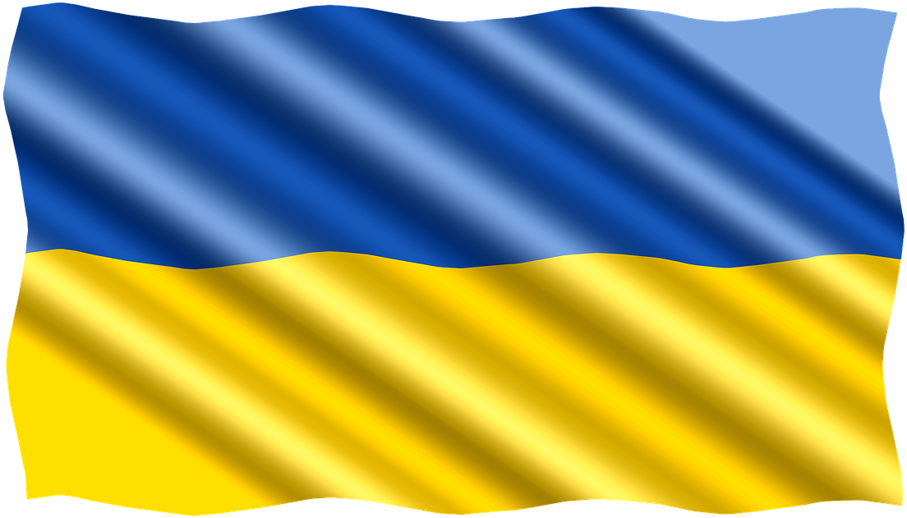

 

  

  <h3 align="center">Application to inform Russian public about current situation in Ukraine</h3>

<!-- ABOUT THE PROJECT -->
## About The Project

Currently I'm working on this aplication wich would help Ukranian people by alllowing them to send text messages to Russian phone numbers with text messages desribing acctual and real situation in Ukraine. This is, due to Russia restrictions, impossible now.

Second part of an application will be the messaging system itselve, htat allows Ukraine supporters from all over the world act as proxy.
